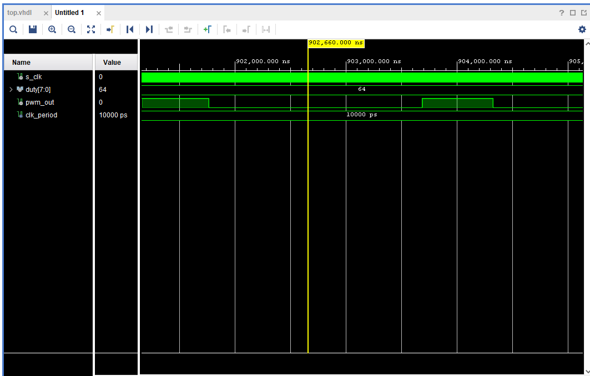
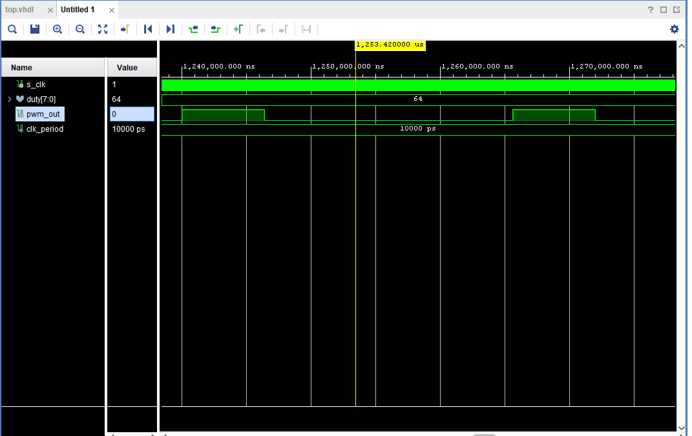
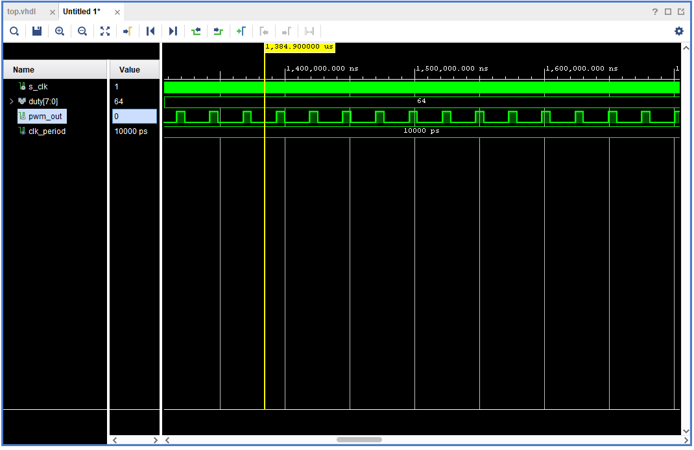

## Project objectives

Cieľom semestrálneho projektu je vytvorenie implementácie generátora PWM signálus s nastavitelnou střídou vo VHDL. Implementácia je splnená v nasledujúcich bodoch: 
1. Nastavenie základnej frekvencie impulzov (2kHz) pomocou modulu clock enable. Násladné privedenie signálu na osciloskop.
2. Rozhodnutie, aká bude maximálna perióda daného výstupu pulzu (duty(%)).
3. Zadefinovanie counter registru s dostatočným počtom bitov (256 kombinacií nastavitelných pomocou prepínačov na doske) na počítanie danej dĺžky času s tým, že sa inkrementuje raz za vstup clocku.
4. Zadefinovanie rovnakej šírky impulzu registru, s akou sme zadefinovali vstupný clock count. To nám pomôže zmeniť výstupný pulz z jednotky na nulu. 
5. Posledným krokom je zadefinovanie výstupného PWM signálu ako jedna, keď  bude hodnota counteru menšia ako hodnota šírky pulzu registru a nula vo všetkých ostatných prípadoch. 

## Popis Hardwaru

### Nexys A7-50
 

Artix-7 je optimalizovaný pre vysoko výkonnú logiku. Vďaka veľkej, vysokokapacitnej FPGA a kolekcii portov USB, Ethernet a ďalších portov môže Nexys A7 
hostiť návrhy od úvodných kombinačných obvodov až po výkonné vstavané procesory. Niekoľko zabudovaných periférií vrátane akcelerometra, teplotného snímača, 
digitálneho mikrofónu MEMs, zosilňovača reproduktorov a množstva vstupno-výstupných zariadení umožňuje používať Nexys A7 pre širokú škálu návrhov 
bez potreby ďalších komponentov. 

## Popis a simulácia modulov napísaných v jazyku VHDL

### clock_enable
Modul clock enable umožňuje v návrhu generovať clock enable signál s pomalšími hodinami. Výhodou je, že nie je potrebné vytvárať ďalšie taktovacie domény, 
čo by spôsobilo problémy s časovaním alebo prekračovaním taktovacej domény.

### PWM generátor
Na generovanie šírkovo modulovaného signálu sa využíva modul PWM generátor. Pomocou switchov na FPGA doske volíme striedu digitálneho signálu. 
Vhodným postupným volením striedy vieme dostať rôzne typy signálov. V našom prípade ide o harmonický signál sínus.
V princípe sa jedná o porovnávanie signálu s_cnt (počíta časové impulzy) so signálom duty, ktorý ak je väčší, tak sa nastaví na nulu.   

### Výsledok testbenchu
                                       

## Popis a simulácia modulov napísaných v jazyku VHDL
V TOP module implementujeme inštanciu logickej funkcie. Prepojuje ostatné moduly s hardvérovými komponentami na doske Nexys A7-50T.  

## Video
https://youtu.be/qjhxOXKObTY

## References

1. Nexys A7-50T References:
https://digilent.com/reference/_media/reference/programmable-logic/nexys-a7/nexys-a7-sch.pdf
https://digilent.com/reference/_media/reference/programmable-logic/nexys-a7/nexys-a7_rm.pdf

2.Nexys A7 Reference Manual:
https://digilent.com/reference/programmable-logic/nexys-a7/reference-manual?redirect=1

3.Github:
https://github.com/tomas-fryza/digital-electronics-1

